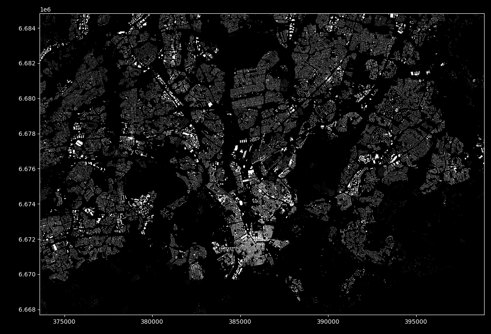
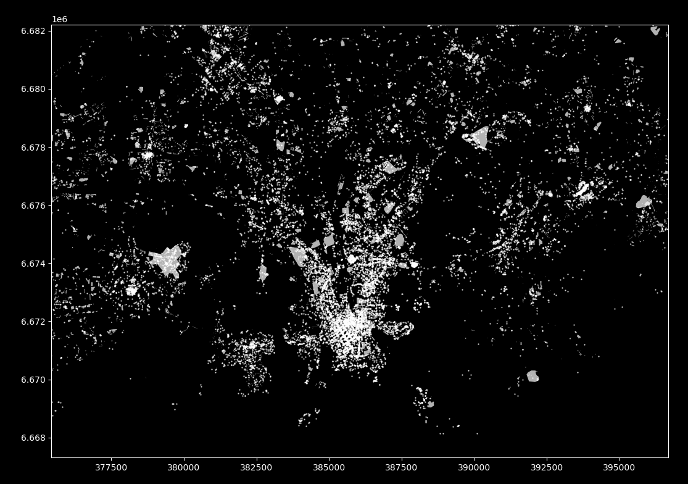

# Pyrosm 
[](https://badge.fury.io/py/pyrosm)
[](https://travis-ci.org/HTenkanen/pyrosm)
[](https://pyrosm.readthedocs.io/en/latest/?badge=latest)
[](https://codecov.io/gh/HTenkanen/pyrosm) 
[](https://pypistats.org/packages/pyrosm)
[](https://zenodo.org/badge/latestdoi/250028367)

**Pyrosm** is a Python library for reading OpenStreetMap data from Protocolbuffer Binary Format -files (`*.osm.pbf`) into Geopandas GeoDataFrames. 
Pyrosm makes it easy to extract various datasets from OpenStreetMap pbf-dumps including e.g. road networks, buildings, 
Points of Interest (POI), landuse and natural elements. Also fully customized queries are supported which makes it possible 
to parse the data from OSM with more specific filters. 

 
**Pyrosm** is easy to use and it provides a somewhat similar user interface as [OSMnx](https://github.com/gboeing/osmnx).
The main difference between pyrosm and OSMnx is that OSMnx reads the data over internet using OverPass API, whereas pyrosm reads the data from local OSM data dumps
that can be downloaded e.g. from [GeoFabrik's website](http://download.geofabrik.de/). This makes it possible to read data much faster thus 
allowing e.g. parsing street networks for whole country in a matter of minutes instead of hours (however, see [caveats](#caveats)).


The library has been developed by keeping performance in mind, hence, it is mainly written in Cython (*Python with C-like performance*) 
which makes it probably faster than any other Python alternatives for parsing OpenStreetMap data.
Pyrosm is built on top of another Cython library called [Pyrobuf](https://github.com/appnexus/pyrobuf) which is a faster Cython alternative 
to Google's Protobuf library: It provides 2-4x boost in performance for deserializing the protocol buffer messages compared to 
Google's version with C++ backend. Google's Protocol Buffers is a commonly used and efficient method to serialize and compress structured data 
which is also used by OpenStreetMap contributors to distribute the OSM data in PBF format (Protocolbuffer Binary Format). 

**Documentation** is available at [https://pyrosm.readthedocs.io](https://pyrosm.readthedocs.io/en/latest/).

## Current features

 - download PBF data easily from hundreds of locations across the world
 - read street networks (separately for driving, cycling, walking and all-combined)
 - read buildings from PBF
 - read Points of Interest (POI) from PBF
 - read landuse from PBF
 - read "natural" from PBF
 - read boundaries from PBF (+ allow searching by name)
 - read any other data from PBF by using a custom user-defined filter
 - filter data based on bounding box
 
 
## Roadmap

 - add possibility to crop PBF and save a subset into new PBF.
 - add Cython specific tests

## Install

Pyrosm is distributed via PyPi and it can be installed with pip:

`$ pip install pyrosm`

### Troubleshooting

Notice that `pyrosm` requires geopandas to work. 
On Linux and Mac installing geopandas with `pip` should work without a problem, which is handled automatically when installing pyrosm. 

However, on Windows installing geopandas with pip is likely to cause issues, hence, it is recommended to install Geopandas before installing
`pyrosm`. See instructions from [Geopandas website](https://geopandas.org/install.html#installation).

## How to use?

Using `pyrosm` is straightforward. See [docs](https://pyrosm.readthedocs.io/en/latest/basics.html) 
for instructions how to use the library.

To read drivable street networks from OpenStreetMap protobuf file (package includes a small test protobuf file), simply:

### Read street networks

```python
from pyrosm import OSM
from pyrosm import get_path
fp = get_path("test_pbf")
# Initialize the OSM parser object
osm = OSM(fp)

# Read all drivable roads
# =======================
drive_net = osm.get_network(network_type="driving")

>>> drive_net.head()
...
  access bridge  ...        id                                           geometry
0   None   None  ...   4732994  LINESTRING (26.94310 60.52580, 26.94295 60.525...
1   None   None  ...   5184588  LINESTRING (26.94778 60.52231, 26.94717 60.522...
2   None    yes  ...   5184589  LINESTRING (26.94891 60.52181, 26.94778 60.52231)
3   None   None  ...   5184590  LINESTRING (26.94310 60.52580, 26.94452 60.525...
4   None   None  ...  22731285  LINESTRING (26.93072 60.52252, 26.93094 60.522...

[5 rows x 14 columns]
```
### Read buildings

```python
# Read all residential and retail buildings
# =========================================
from pyrosm import OSM
from pyrosm import get_path
fp = get_path("test_pbf")
# Initialize the OSM parser object
osm = OSM(fp)
custom_filter = {'building': ['residential', 'retail']}
buildings = osm.get_buildings(custom_filter=custom_filter)

>>> buildings.head()
...
      building  ...                                           geometry
0       retail  ...  POLYGON ((26.94511 60.52322, 26.94487 60.52314...
1       retail  ...  POLYGON ((26.95093 60.53644, 26.95083 60.53642...
2  residential  ...  POLYGON ((26.96536 60.52540, 26.96528 60.52539...
3  residential  ...  POLYGON ((26.93920 60.53257, 26.93940 60.53254...
4  residential  ...  POLYGON ((26.96578 60.52129, 26.96569 60.52137...
```

### Read Points of Interest

```python
# Read POIs such as shops and amenities 
# =====================================
from pyrosm import OSM
from pyrosm import get_path
fp = get_path("test_pbf")
# Initialize the OSM parser object
osm = OSM(fp)
custom_filter = {'amenity': True, 'shop': True }
pois = osm.get_pois(custom_filter=custom_filter)

>>> pois.head()
...
   changeset   timestamp        lon  version  ...  phone  building landuse parking
0        0.0  1461601534  26.951475        2  ...    NaN       NaN     NaN     NaN
1        0.0  1310921959  26.945166        3  ...    NaN       NaN     NaN     NaN
2        0.0  1347308819  26.932177        2  ...    NaN       NaN     NaN     NaN
3        0.0  1310921960  26.949650        2  ...    NaN       NaN     NaN     NaN
4        0.0  1307995246  26.959021        1  ...    NaN       NaN     NaN     NaN

[5 rows x 22 columns]
```   

### Read landuse/natural

```python
# Read landuse and natural
# =====================================
from pyrosm import OSM
from pyrosm import get_path
fp = get_path("test_pbf")
# Initialize the OSM parser object
osm = OSM(fp)
landuse = osm.get_landuse()
natural = osm.get_natural()

>>> natural.head()
...
           id   timestamp  changeset  ...                   geometry osm_type  water
0    29985880  1496174642        0.0  ...  POINT (24.95299 60.17726)     node    NaN
1   379182204  1511211673        0.0  ...  POINT (24.95300 60.16710)     node    NaN
2   946524698  1286962007        0.0  ...  POINT (24.94548 60.17759)     node    NaN
3  1533462976  1408442828        0.0  ...  POINT (24.95214 60.17820)     node    NaN
4  1533462983  1408442828        0.0  ...  POINT (24.95223 60.17820)     node    NaN

[5 rows x 12 columns]
```   
### Read OSM data with custom filter

Pyrosm also allows making custom queries. For example, to parse all transit related OSM elements you can use following approach 
and create a custom filter combining multiple criteria:

```python
from pyrosm import OSM
from pyrosm import get_path
fp = get_path("helsinki_pbf")

# Initialize the OSM parser object with test data from Helsinki
osm = OSM(fp)

# Test reading all transit related data (bus, trains, trams, metro etc.)
# Exclude nodes (not keeping stops, etc.)
routes = ["bus", "ferry", "railway", "subway", "train", "tram", "trolleybus"]
rails = ["tramway", "light_rail", "rail", "subway", "tram"]
bus = ['yes']
transit = osm.get_data_by_custom_criteria(custom_filter={
                                        'route': routes,
                                        'railway': rails,
                                        'bus': bus,
                                        'public_transport': True},
                                        # Keep data matching the criteria above
                                        filter_type="keep",
                                        # Do not keep nodes (point data)    
                                        keep_nodes=False, 
                                        keep_ways=True, 
                                        keep_relations=True)

>>> transit.head()
  bicycle   bus  ...                                           geometry osm_type
0    None  None  ...  LINESTRING (24.94133 60.17141, 24.94114 60.173...      way
1    None  None  ...  LINESTRING (24.94024 60.17530, 24.94020 60.175...      way
2    None  None  ...  LINESTRING (24.94115 60.17597, 24.94092 60.176...      way
3      no   yes  ...  LINESTRING (24.94271 60.17099, 24.94282 60.17093)      way
4    None  None  ...  LINESTRING (24.93872 60.16970, 24.93893 60.169...      way

[5 rows x 17 columns]
```

### Help

To get further information how to use the tool, you can use good old `help`:

```python

help(osm.get_network)

...

Help on method get_network in module pyrosm.pyrosm:

get_network(network_type='walking') method of pyrosm.pyrosm.OSM instance
    Reads data from OSM file and parses street networks
    for walking, driving, and cycling.
    
    Parameters
    ----------
    
    network_type : str
        What kind of network to parse. Possible values are: 'walking' | 'cycling' | 'driving' | 'all'.

```

## Performance

See [docs](https://pyrosm.readthedocs.io/en/latest/benchmarking.html) for more comprehensive benchmarking tests. Reading all drivable roads in Helsinki Region (approx. 85,000 roads) 
takes approximately **12 seconds** (laptop with 16GB memory, SSD drive, and Intel Core i5-8250U CPU 1.6 GHZ). And the result looks something like:


Parsing all buildings from the same area (approx. 180,000) takes approximately **17 seconds**. And the result looks something like:



Parsing all Points of Interest (POIs) with defaults elements (amenities, shops and tourism) 
takes approximately **14 seconds** (approx. 32,000 features). 
And the result looks something like:




## Get in touch

If you find a bug from the tool, have question, 
or would like to suggest a new feature to it, you can [make a new issue here](https://github.com/HTenkanen/pyrosm/issues).

## Development

You can install a local development version of the tool by 1) installing necessary packages with conda and 2) building pyrosm from source:

 1. install conda-environment for Python 3.7 or 3.8 by:
 
    - Python 3.7 (you might want to modify the env-name which is `test` by default): `$ conda env create -f ci/37-conda.yaml`
    - Python 3.8: `$ conda env create -f ci/38-conda.yaml`
    
 2. build pyrosm development version from master (activate the environment first):
 
    - `pip install -e .`

You can run tests with `pytest` by executing:
 
  `$ pytest -v` 
  

## License and copyright

Pyrosm is licensed under MIT (see [license](LICENSE)). 

The OSM data is downloaded from two sources:

[](https://download.geofabrik.de/)
[](https://download.bbbike.org/osm/)

Data &copy; [Geofabrik GmbH](http://www.geofabrik.de/), [BBBike](https://download.bbbike.org/) and [OpenStreetMap Contributors](http://www.openstreetmap.org/) 

All data from the [OpenStreetMap](https://www.openstreetmap.org) is licensed under the [OpenStreetMap License](https://www.openstreetmap.org/copyright). 

## Caveats

### Filtering large files by bounding box 

Although `pyrosm` provides possibility to filter even larger data files based on bounding box, 
this process can slow down the reading process significantly (1.5-3x longer) due to necessary lookups when parsing the data. 
This might not be an issue with smaller files (up to ~100MB) but with larger data dumps this can take longer than necessary.

Hence, a recommended approach with large data files is to **first** filter the protobuf file based on bounding box into a 
smaller subset by using a dedicated open source Java tool called [Osmosis](https://wiki.openstreetmap.org/wiki/Osmosis) 
which is available for all operating systems. Detailed installation instructions are [here](https://wiki.openstreetmap.org/wiki/Osmosis/Installation), 
and instructions how to filter data based on bounding box are [here](https://wiki.openstreetmap.org/wiki/Osmosis/Examples#Extract_administrative_Boundaries_from_a_PBF_Extract).


